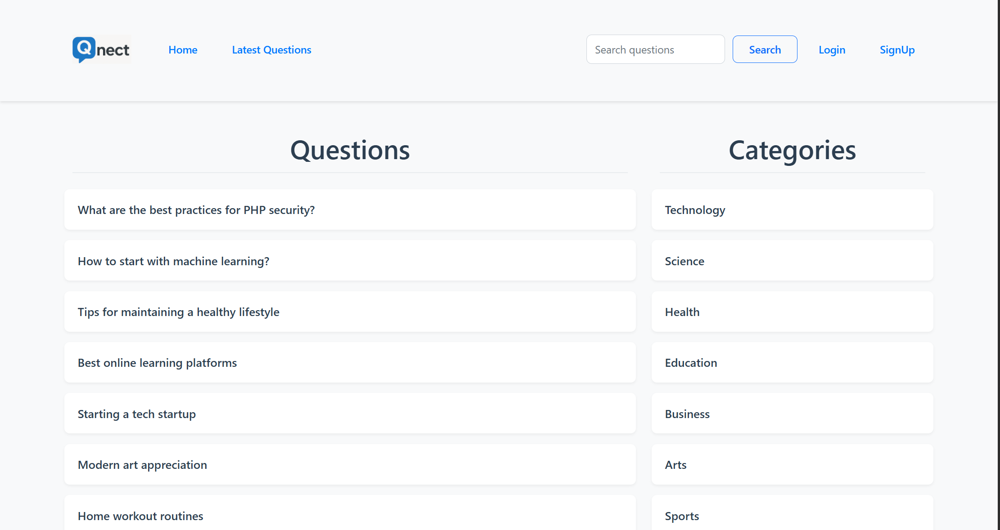
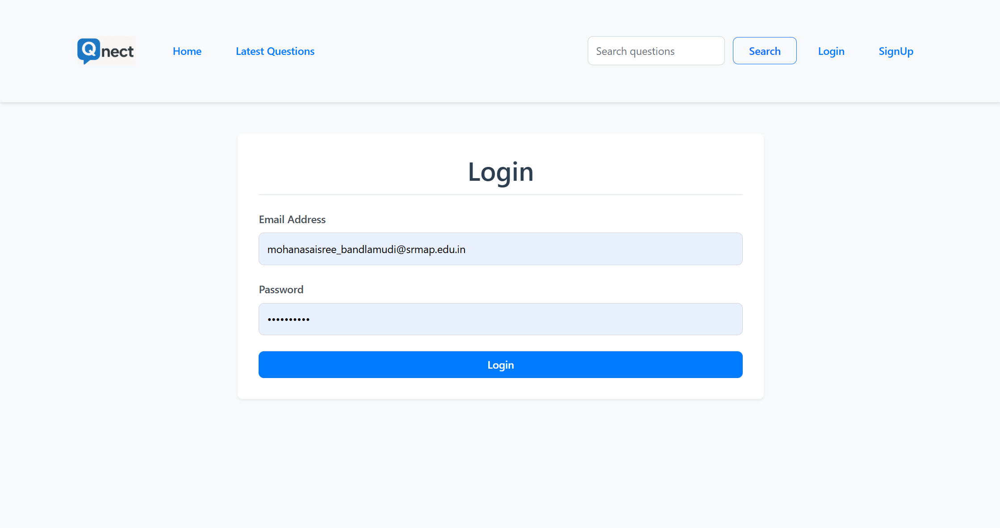
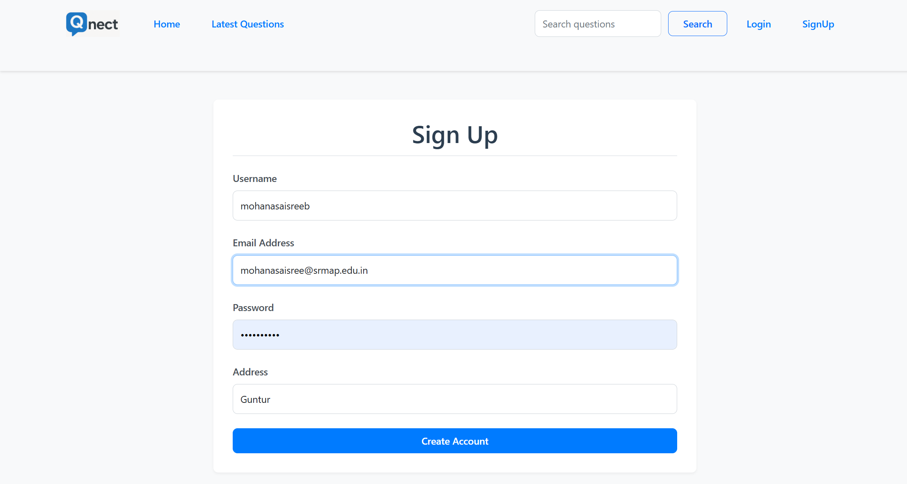
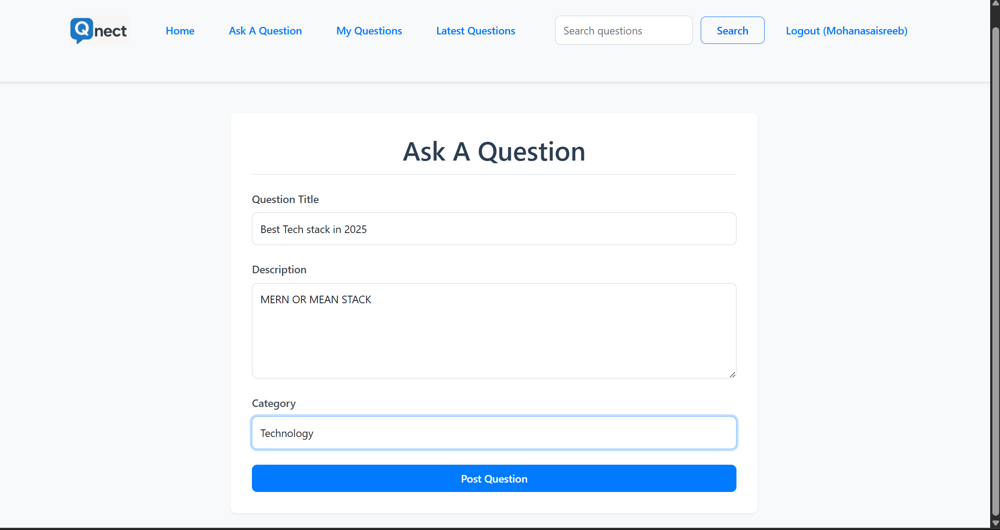
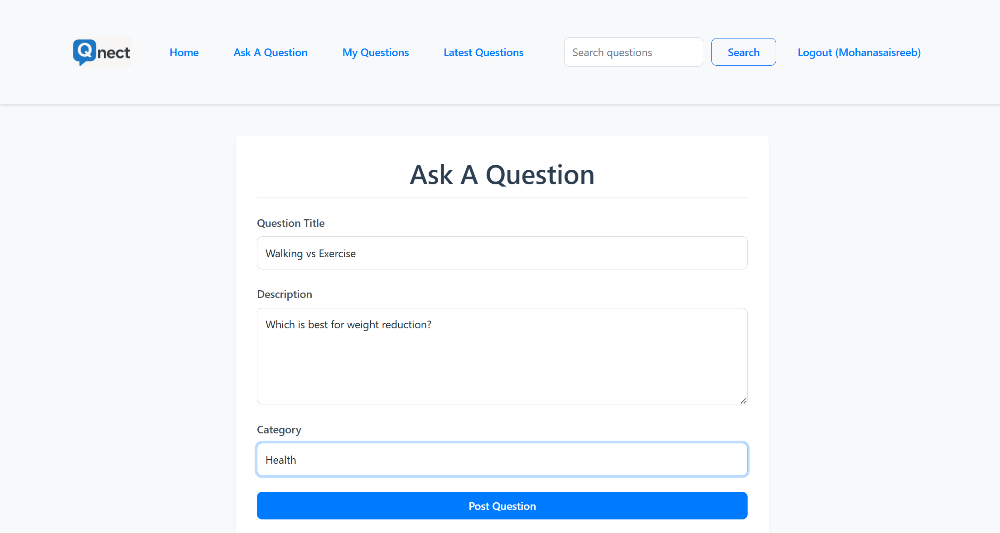
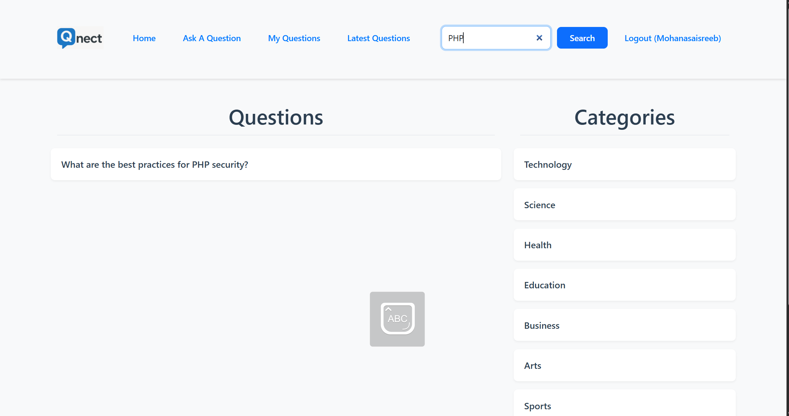
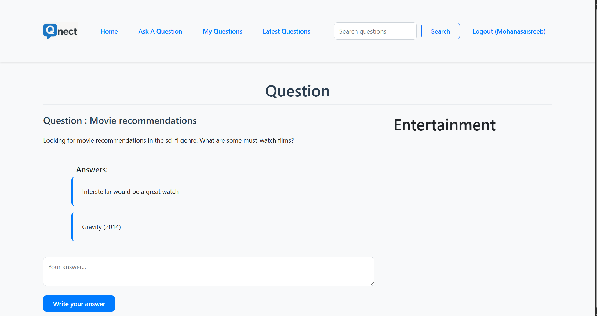
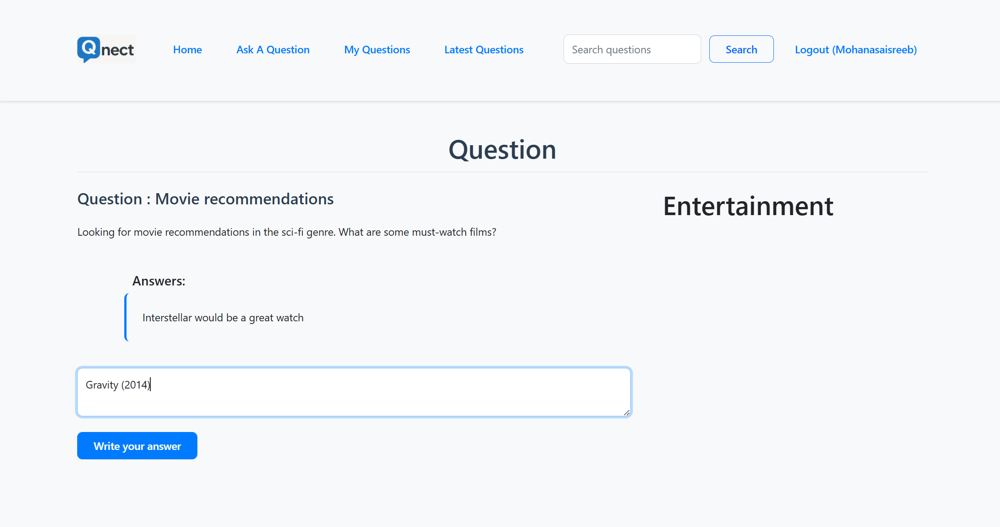
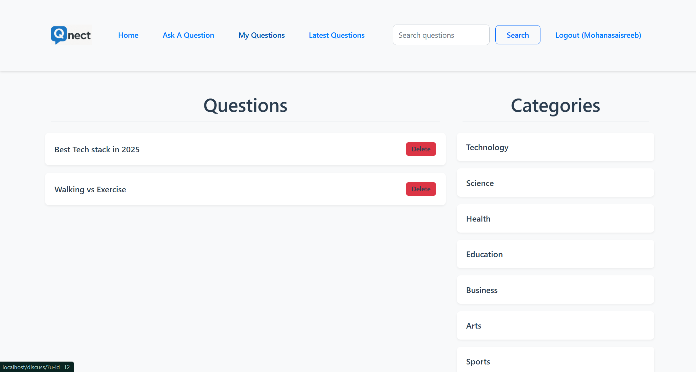
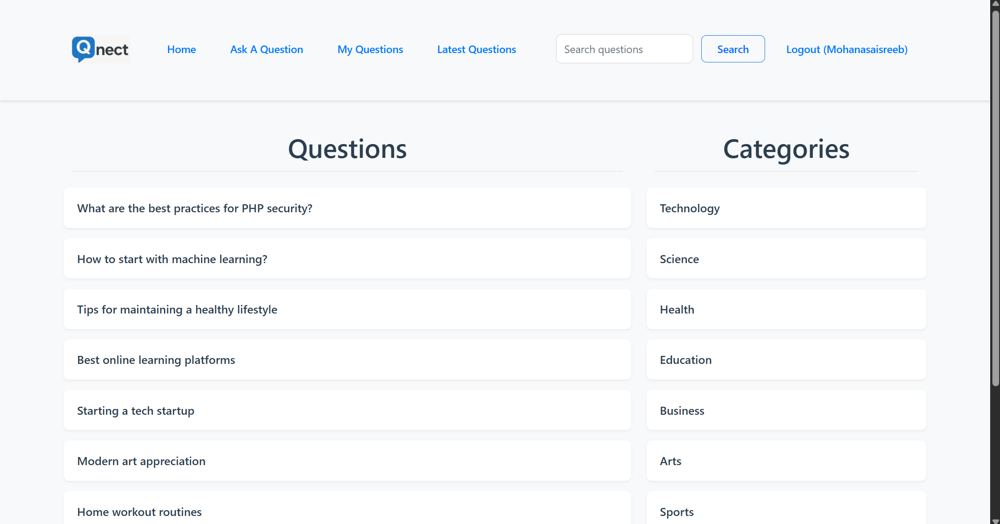

# Qnect - Where Questions Connect People

Qnect is a dynamic discussion platform where users can ask questions, share knowledge, and connect with others through meaningful discussions. Built with PHP and MySQL, this platform provides a user-friendly interface for knowledge sharing and community engagement.

## Features

- User Authentication (Signup/Login)
- Ask Questions
- Answer Questions
- Category-based Question Organization
- Search Functionality
- User Profile Management
- Latest Questions Feed
- Responsive Design

##Project Screenshots

## Project Screenshots

### 🏠 Home Page


### 🔐 Login Page


### 📝 Signup Page


### 🙋 Ask a Question


### 🙋 Ask a Question - Detailed


### 🔍 Search Questions


### ❓ View a Question & Answers


### 🧾 Add an Answer


### 🙋 My Questions Page


### 👤 Logged In View



## Prerequisites

- PHP 7.0 or higher
- MySQL 5.7 or higher
- Apache/Nginx Web Server
- XAMPP/WAMP/MAMP (for local development)

## Installation

1. Clone the repository to your local machine:
```bash
git clone [repository-url]
```

2. Set up your web server (XAMPP/WAMP/MAMP) and place the project in the appropriate directory:
   - For XAMPP: `htdocs/phpdiscussion`
   - For WAMP: `www/phpdiscussion`
   - For MAMP: `htdocs/phpdiscussion`

3. Create a new MySQL database named `discuss`

4. Import the database schema:
   - Open phpMyAdmin
   - Select the `discuss` database
   - Go to the Import tab
   - Choose the `database.sql` file from this project
   - Click Go to import the database structure

5. Configure the database connection:
   - Open `common/db.php`
   - Update the database credentials if needed:
     ```php
     $host = "localhost";
     $username = "root";
     $password = ""; // Your MySQL password
     $database = "discuss";
     ```

6. . Access the website:
   - Open your web browser
   - Navigate to `http://localhost/phpdiscussion`

## Project Structure

```
phpdiscussion/
├── client/             # Frontend components
│   ├── ask.php        # Question asking form
│   ├── answers.php    # Answer display
│   ├── category.php   # Category selection
│   ├── header.php     # Navigation header
│   ├── login.php      # Login form
│   ├── questions.php  # Questions listing
│   └── signup.php     # Registration form
├── common/            # Shared resources
│   └── db.php        # Database connection
├── public/           # Static assets
│   ├── images/      # Website images
│   ├── style.css    # Custom styles
│   └── logo.png     # Site logo
├── server/          # Backend processing
│   └── requests.php # API endpoints
└── index.php        # Main entry point
```

## Usage

1. **Registration/Login**
   - New users can create an account using the Sign Up option
   - Existing users can log in using their email and password

2. **Asking Questions**
   - Click on "Ask A Question" in the navigation bar
   - Fill in the question title, description, and select a category
   - Submit your question

3. **Answering Questions**
   - Browse questions on the home page
   - Click on a question to view its details
   - Use the answer form to provide your response

4. **Browsing Questions**
   - View all questions on the home page
   - Filter questions by category
   - Search for specific questions using the search bar
   - View latest questions using the "Latest Questions" option

Created by @mohanabandlamudi
